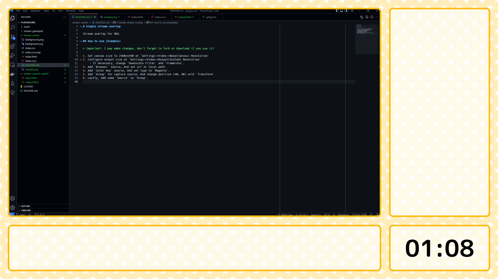

# Simple stream overlay

Stream overlay for OBS.

## How to use (Example)

> Important: I may make changes, don't forget to fork or download if you use it!

1. Set canvas size to 2560x1440 at `Settings->Video->Base(Canvas) Resolution`
2. Configure output size at `Settings->Video->Output(Scaled) Resolution`
    - If necessary, change `Downscale Filter` and `Framerate`.
3. Add `Browser` source, And set url or local path.
4. Add `Color Key` source, And set type to `Magenta`.
5. Add `Group` for capture source, And change position (40, 40) with `Transform`.
6. Lastly, Add some `Source` to `Group`.
